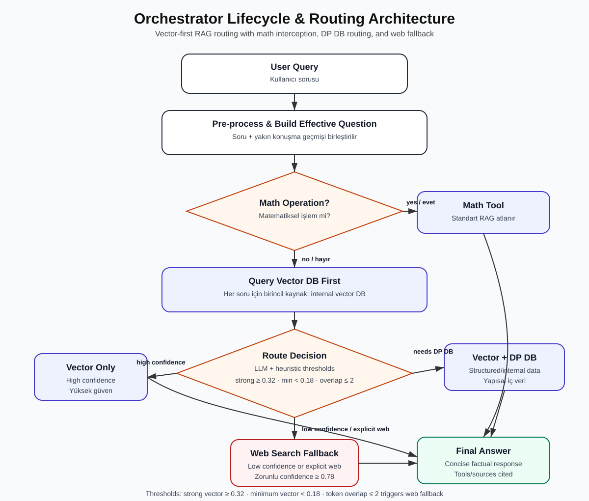
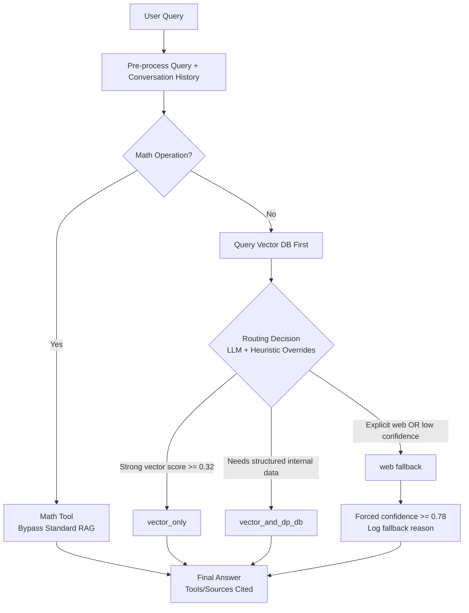
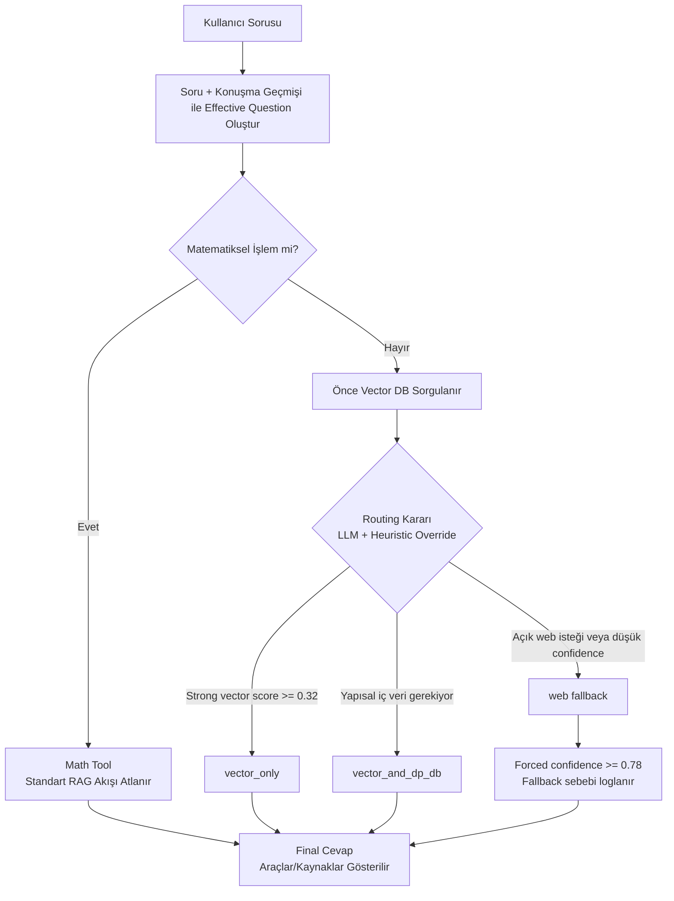

# Orchestrator Lifecycle & Routing Architecture / Orchestrator Yaşam Döngüsü ve Yönlendirme Mimarisi



> **Purpose / Amaç:** This document explains how the AI Orchestrator resolves user questions using a vector-first RAG strategy, math interception, smart routing, heuristic overrides, and controlled fallback behavior.  
> **Amaç:** Bu doküman, AI Orchestrator’ın kullanıcı sorularını vector-first RAG yaklaşımı, matematik yakalama, akıllı yönlendirme, kural tabanlı düzeltmeler ve kontrollü fallback davranışıyla nasıl çözdüğünü açıklar.

---

## 1. English Version

### 1.1 Orchestrator Lifecycle

The orchestrator follows a strict, multi-step lifecycle to resolve user queries efficiently while minimizing unnecessary external API calls.

1. **Query Pre-processing & Context Building**  
   The raw user query is combined with recent conversation history to form an **effective question**. This helps the system understand the current user intent without losing conversational context.

2. **Math Interception**  
   The query is evaluated for mathematical operations. If a math operation is detected, the request is routed to a specialized **Math Tool**, bypassing the standard RAG pipeline.

3. **Vector DB as the Primary Source**  
   By default, the system queries the internal **Vector DB first for every question**. This ensures that domain-specific and internal knowledge is always checked before external tools are used.

4. **Smart LLM Routing**  
   A routing LLM evaluates the user intent and the quality of the retrieved Vector DB context. It then decides the best route:

   - `vector_only`
   - `vector_and_dp_db`
   - `web`

5. **Heuristic Overrides & Fallback**  
   System-level rules can override the routing LLM decision. These rules enforce confidence thresholds, prevent unnecessary web searches, and trigger fallback behavior when internal context is missing or weak.

6. **Context Assembly & Answer Generation**  
   Context from the selected source or sources is assembled and passed to the final LLM. The final answer is concise, factual, and includes the tools or sources used.

---

### 1.2 Routing Conditions: Vector DB vs. Web Search

The system intelligently balances internal data and external web search using the following routing conditions.

#### Explicit Web Search

Web search is triggered when:

- the user explicitly asks to search the web,
- the user asks for current, latest, or real-time information,
- the user asks for the current/latest version of a public NPM package.

#### Low-Confidence Web Fallback

Web search fallback is triggered when:

- Vector DB results do not meet the minimum confidence threshold,
- retrieved chunks are only **guidance-only** content, such as internal orchestration instructions,
- the chunks do not provide enough factual evidence to answer the question.

#### High-Confidence Vector Override

If Vector DB results meet the required confidence and token overlap conditions, the system forces a `vector_only` route. This actively disables unnecessary web search and prevents routing hallucinations from the LLM.

---

### 1.3 Vector DB Confidence Thresholds & Fallback Behavior

The routing logic uses mathematically defined thresholds to evaluate Vector DB evidence.

| Rule | Value | Meaning | Action |
|---|---:|---|---|
| `ROUTING_STRONG_VECTOR_THRESHOLD` | `0.32` | High-confidence vector evidence | Strongly favor internal Vector DB |
| `ROUTING_MIN_VECTOR_THRESHOLD` | `0.18` | Minimum acceptable vector evidence | Below this value, route to web fallback |
| Token overlap requirement | `<= 2 words` | Weak lexical overlap between question and chunks | Route to web fallback |
| Forced fallback confidence | `>= 0.78` | Confidence injected when web fallback is forced | Log fallback as intentional routing |

#### Threshold Logic

```text
if top_vector_score >= 0.32:
    route = vector_only

elif top_vector_score < 0.18:
    route = web
    forced_confidence >= 0.78
    reason = "Internal vector evidence is not sufficient, so the question is routed to web search."

elif token_overlap <= 2:
    route = web
    forced_confidence >= 0.78
    reason = "Internal vector evidence is not sufficient, so the question is routed to web search."

else:
    route = routing_llm_decision
```

---

### 1.4 Flowchart



---

## 2. Türkçe Versiyon

### 2.1 Orchestrator Yaşam Döngüsü

Orchestrator, kullanıcı sorularını verimli şekilde çözmek ve gereksiz dış API çağrılarını azaltmak için katı ve çok adımlı bir yaşam döngüsü izler.

1. **Soru Ön İşleme ve Bağlam Oluşturma**  
   Ham kullanıcı sorusu, son konuşma geçmişiyle birleştirilerek **effective question** adı verilen daha anlamlı bir soru haline getirilir. Böylece sistem, kullanıcının gerçek niyetini konuşma bağlamını kaybetmeden anlayabilir.

2. **Matematik Yakalama**  
   Soru matematiksel işlem içeriyor mu diye kontrol edilir. Eğer matematiksel bir işlem tespit edilirse istek özel bir **Math Tool** aracına yönlendirilir ve standart RAG akışı atlanır.

3. **Birincil Kaynak Olarak Vector DB**  
   Varsayılan davranış olarak sistem **her soru için önce internal Vector DB’yi sorgular**. Böylece domain-specific ve iç bilgi kaynakları, dış araçlardan önce değerlendirilmiş olur.

4. **Akıllı LLM Yönlendirme**  
   Routing LLM, kullanıcının niyetini ve Vector DB’den dönen bağlamın kalitesini değerlendirir. Ardından en uygun rotayı seçer:

   - `vector_only`
   - `vector_and_dp_db`
   - `web`

5. **Heuristic Override ve Fallback**  
   Sistem seviyesindeki kurallar, routing LLM kararını gerektiğinde ezebilir. Bu kurallar confidence threshold’larını uygular, gereksiz web aramalarını engeller ve internal context eksik ya da zayıfsa fallback davranışını tetikler.

6. **Context Assembly ve Cevap Üretimi**  
   Seçilen kaynak veya kaynaklardan gelen context birleştirilir ve final LLM’e verilir. Final cevap kısa, gerçekçi ve kullanılan araçları/kaynakları gösteren şekilde üretilir.

---

### 2.2 Routing Koşulları: Vector DB mi, Web Search mü?

Sistem, aşağıdaki koşullara göre internal veri ile external web search arasında akıllı bir denge kurar.

#### Açık Web Search İsteği

Web search şu durumlarda tetiklenir:

- kullanıcı açıkça web’de arama yapılmasını isterse,
- kullanıcı güncel, en son veya gerçek zamanlı bilgi isterse,
- kullanıcı public bir NPM paketinin current/latest versiyonunu sorarsa.

#### Düşük Güvenli Web Fallback

Web fallback şu durumlarda tetiklenir:

- Vector DB sonuçları minimum confidence threshold değerini karşılamazsa,
- dönen chunk’lar sadece **guidance-only** içerikse, yani gerçek cevaptan çok internal orchestration yönergeleri içeriyorsa,
- chunk’lar soruya cevap verecek kadar factual evidence sağlamıyorsa.

#### Yüksek Güvenli Vector Override

Vector DB sonuçları gerekli confidence ve token overlap koşullarını sağlıyorsa sistem `vector_only` rotasını zorlar. Bu davranış gereksiz web aramasını kapatır ve LLM’in yanlışlıkla web search istemesini engeller.

---

### 2.3 Vector DB Confidence Threshold’ları ve Fallback Davranışı

Routing logic, Vector DB sonuçlarının yeterliliğini ölçmek için matematiksel olarak tanımlanmış threshold değerlerini kullanır.

| Kural | Değer | Anlamı | Aksiyon |
|---|---:|---|---|
| `ROUTING_STRONG_VECTOR_THRESHOLD` | `0.32` | Yüksek güvenli vector evidence | Internal Vector DB güçlü şekilde tercih edilir |
| `ROUTING_MIN_VECTOR_THRESHOLD` | `0.18` | Minimum kabul edilebilir vector evidence | Bunun altındaysa web fallback tetiklenir |
| Token overlap requirement | `<= 2 kelime` | Soru ile chunk arasında zayıf kelime örtüşmesi | Web fallback tetiklenir |
| Forced fallback confidence | `>= 0.78` | Web fallback zorlandığında enjekte edilen confidence | Fallback bilinçli routing olarak loglanır |

#### Threshold Mantığı

```text
if top_vector_score >= 0.32:
    route = vector_only

elif top_vector_score < 0.18:
    route = web
    forced_confidence >= 0.78
    reason = "Internal vector evidence is not sufficient, so the question is routed to web search."

elif token_overlap <= 2:
    route = web
    forced_confidence >= 0.78
    reason = "Internal vector evidence is not sufficient, so the question is routed to web search."

else:
    route = routing_llm_decision
```

---

### 2.4 Akış Diyagramı



---

## 3. Key Design Principle / Temel Tasarım Prensibi

**English:** The orchestrator is intentionally vector-first. Web search is not the default route; it is used only when the user explicitly asks for it, when current external information is required, or when internal vector evidence is too weak to support a reliable answer.

**Türkçe:** Orchestrator bilinçli olarak vector-first tasarlanmıştır. Web search varsayılan rota değildir; yalnızca kullanıcı açıkça isterse, güncel dış bilgi gerekiyorsa veya internal vector evidence güvenilir cevap üretmek için çok zayıfsa kullanılır.

---

## 4. Logging Recommendation / Loglama Önerisi

Every routing decision should log the following fields:

Her routing kararı için aşağıdaki alanlar loglanmalıdır:

```json
{
  "effectiveQuestion": "...",
  "mathDetected": false,
  "vectorTopScore": 0.27,
  "tokenOverlap": 4,
  "routingDecision": "vector_only",
  "heuristicOverrideApplied": true,
  "fallbackReason": null,
  "toolsUsed": ["vector_db"],
  "finalConfidence": 0.82
}
```

This makes the routing behavior explainable, testable, and easier to debug during demos.

Bu yapı routing davranışını açıklanabilir, test edilebilir ve demo sırasında debug etmesi kolay hale getirir.
